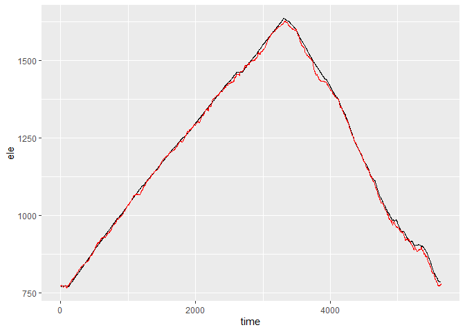
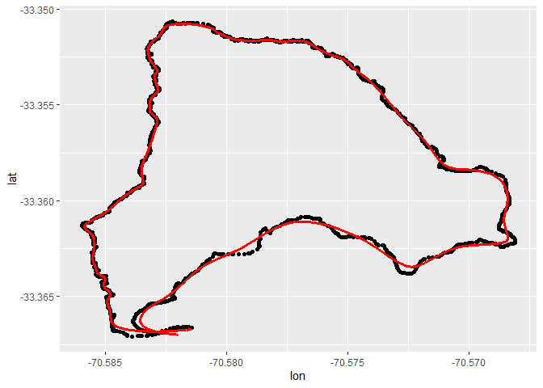
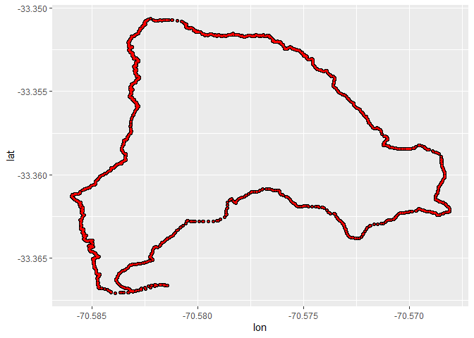
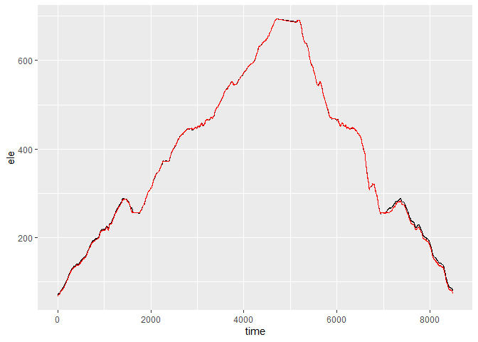
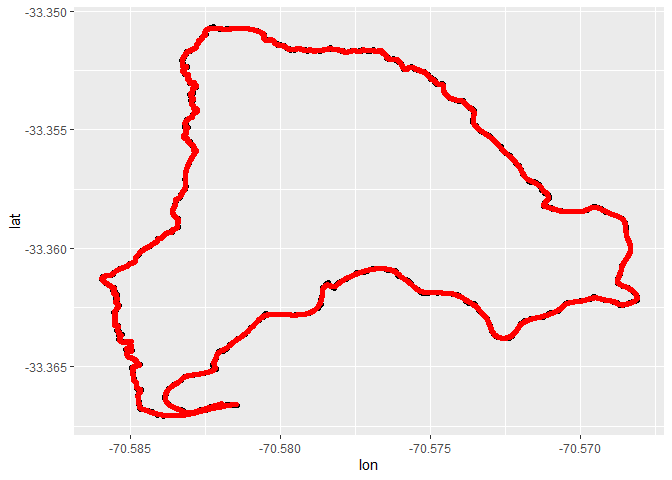
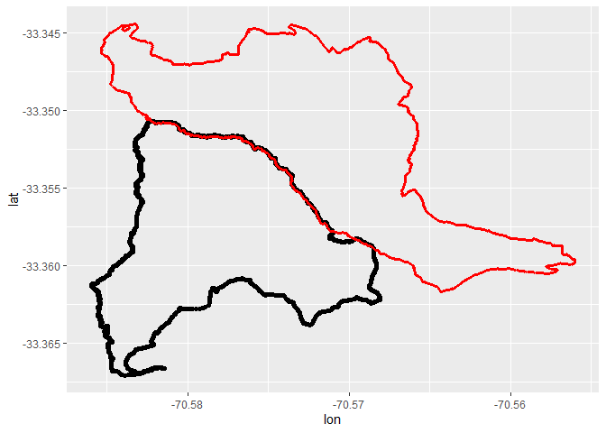
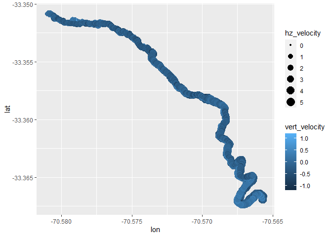
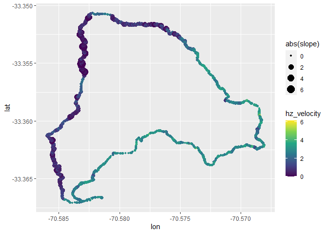

<!-- README.md is generated from README.Rmd. Please edit that file -->

# GPStream

<!-- badges: start -->
<!-- badges: end -->

The goal of GPStream is to process GPS generated data such as used in
sports apps and wearable devices. You can find functions to load the
data and process it. The package can read streams of GPS readings,
consisting in latitude, longitude, elevation and time and compute
several features for each measure.

GPS data streams can be obtained several ways. The most common file
format is GPX files, an XML variant for GPS readings, but fit files
(from Garmin devices) and KML files are also supported. Some sports apps
like strava offers API services from which streams can be obtained.

For more information about gathering GPX/fit files from strava follow
the steps described by
[marcusvolz/strava](https://github.com/marcusvolz/strava)

For more information about gathering streams from strava API follow the
steps described by
[fawda123/rStrava](https://github.com/fawda123/rStrava)

This package contains raw files and sample data as it comes from the
latter alternative. Both activity metadata and streams are available,
corresponding to activities recorded by the author

### Overview and installation

This is the development repository for GPStream, an R package to
analyze data from a GPS stream. The development version from
[GitHub](https://github.com/) can be installed and loaded as follows:

``` r
# install.packages("remotes")
remotes::install_github("raimun2/GPStream")
```

## Example

This is a basic example which shows you how to load sample data:

``` r
library(GPStream)

data(strava_streams)

act_streams <- strava_streams
```

Data can also be loaded from stream files such as GPX or fit files

``` r
gpx_stream <- read_stream("inst/extdata/gpx_activity.gpx")

str(gpx_stream)
#> tibble [2,510 x 4] (S3: tbl_df/tbl/data.frame)
#>  $ lat      : num [1:2510] -33.4 -33.4 -33.4 -33.4 -33.4 ...
#>  $ lon      : num [1:2510] -70.6 -70.6 -70.6 -70.6 -70.6 ...
#>  $ ele      : num [1:2510] 772 771 772 771 771 ...
#>  $ timestamp: POSIXct[1:2510], format: "2020-08-10 19:36:38" "2020-08-10 19:36:39" ...

fit_stream <- read_stream("inst/extdata/fit_activity.fit")

str(fit_stream)
#> tibble [2,510 x 10] (S3: tbl_df/tbl/data.frame)
#>  $ timestamp         : POSIXct[1:2510], format: "2020-08-10 19:36:38" "2020-08-10 19:36:39" ...
#>  $ position_lat      : num [1:2510] -33.4 -33.4 -33.4 -33.4 -33.4 ...
#>   ..- attr(*, "units")= chr "degrees"
#>  $ position_long     : num [1:2510] -70.6 -70.6 -70.6 -70.6 -70.6 ...
#>   ..- attr(*, "units")= chr "degrees"
#>  $ distance          : num [1:2510] 2.16 4.75 12.66 15.35 18.86 ...
#>   ..- attr(*, "units")= chr "m"
#>  $ altitude          : num [1:2510] 772 771 772 771 771 ...
#>   ..- attr(*, "units")= chr "m"
#>  $ speed             : num [1:2510] 1.16 1.29 2.36 2.48 2.5 ...
#>   ..- attr(*, "units")= chr "m/s"
#>  $ heart_rate        : int [1:2510] 106 108 111 114 117 121 125 127 130 133 ...
#>   ..- attr(*, "units")= chr "bpm"
#>  $ cadence           : int [1:2510] 47 47 76 76 77 79 79 79 79 80 ...
#>   ..- attr(*, "units")= chr "rpm"
#>  $ temperature       : int [1:2510] 27 27 27 27 27 27 27 27 27 27 ...
#>   ..- attr(*, "units")= chr "C"
#>  $ fractional_cadence: num [1:2510] 0.5 0.5 0.5 0.5 0 0.5 0.5 0 0 0 ...
#>   ..- attr(*, "units")= chr "rpm"
```

As can be seen, not all files contains the same naming convention for
coordinates, so we follow the lat, lon, ele, timestamp, time convention
for latitude, longitude, elevation and time signature respectively. This
convention is implemented in uniform_stream() function.

``` r
clean_stream1 <- act_streams %>% uniform_stream() %>% filter(id == unique(act_streams$id)[1])

clean_stream2 <- gpx_stream %>% uniform_stream()

clean_stream3 <- fit_stream %>% uniform_stream()

str(clean_stream2)
#> tibble [2,510 x 5] (S3: tbl_df/tbl/data.frame)
#>  $ lon      : num [1:2510] -70.6 -70.6 -70.6 -70.6 -70.6 ...
#>  $ lat      : num [1:2510] -33.4 -33.4 -33.4 -33.4 -33.4 ...
#>  $ ele      : num [1:2510] 772 771 772 771 771 ...
#>  $ time     : num [1:2510] 0 1 4 5 6 9 11 12 15 18 ...
#>  $ timestamp: POSIXct[1:2510], format: "2020-08-10 19:36:38" "2020-08-10 19:36:39" ...
```

In several occasions elevation readings can be corrupted or missing, so
the ele_correction() function is implemented, obtaining elevation data
from a digital elevation model (DEM) available in the elevatr package,
or in a local DEM if available.

``` r
correct_elevation <- clean_stream2 %>% ele_correction(replace = FALSE, z = 14)
#> Mosaicing & Projecting
#> Note: Elevation units are in meters.

ggplot(correct_elevation, aes(x=time)) + 
  geom_line(aes(y=ele)) + 
  geom_line(aes(y=ele_DEM), col="red")
```



In other cases, even lat and lon values can be corrupted and therefore
need smoothing in order to represent distances correctly. Smoothing can
be also applied to interpolate a stream and obtaining an even spaced
model of the activity

``` r
smooth_act <- correct_elevation %>% smooth_stream(interpolate = TRUE, alpha = 0.05, replace = TRUE)

ggplot(correct_elevation, aes(lon, lat)) + 
  geom_point() + 
  geom_point(data = smooth_act, col="red", size=0.7)
```

 So far we
have corrected coordinates, but we can also estimate different
differential features, such as slope, distance, elevation gain/loss,
speed, etc. For this purposes is the function differential_stream

``` r
diff_stream <- smooth_act %>% differential_stream()

str(diff_stream)
#> 'data.frame':    5639 obs. of  19 variables:
#>  $ time          : int  1 2 3 4 5 6 7 8 9 10 ...
#>  $ lon           : num  -70.6 -70.6 -70.6 -70.6 -70.6 ...
#>  $ lat           : num  -33.4 -33.4 -33.4 -33.4 -33.4 ...
#>  $ ele           : num  773 773 772 772 772 ...
#>  $ delta_distance: num  0 3.57 3.55 3.52 3.5 ...
#>  $ distance      : num  0 3.57 7.11 10.64 14.14 ...
#>  $ azimuth       : num  180 162 180 180 180 ...
#>  $ delta_ele     : num  0 -0.1057 -0.1034 -0.1011 -0.0988 ...
#>  $ dplus         : num  0 0 0 0 0 0 0 0 0 0 ...
#>  $ dminus        : num  0 -0.1057 -0.1034 -0.1011 -0.0988 ...
#>  $ slope         : num  0 -0.0296 -0.0292 -0.0287 -0.0282 ...
#>  $ delta_time    : num  0 1 1 1 1 1 1 1 1 1 ...
#>  $ hz_velocity   : num  0 3.57 3.55 3.52 3.5 ...
#>  $ hz_accel      : num  0 3.57 3.55 3.52 3.5 ...
#>  $ pace          : num  0 4.67 4.7 4.73 4.76 ...
#>  $ vert_velocity : num  0 -0.1057 -0.1034 -0.1011 -0.0988 ...
#>  $ vert_accel    : num  0 -0.1057 -0.1034 -0.1011 -0.0988 ...
#>  $ velocity      : num  0 3.57 3.55 3.53 3.5 ...
#>  $ accel         : num  0 3.57 3.55 3.53 3.5 ...
```

We can also compare two streams to check if they correspond to the same
route. The match stream function checks the spatial and sequential
continuity of a stream with respect to a reference stream.

For example, with matching streams the function returns the first row
and length of the first stream where it matches the second one.

``` r
data <- clean_stream1
route <- clean_stream2
match_stream(data, route)
#>      [,1] [,2]
#> [1,]    1 2510
```



If we invert the order of the second stream the function detects it

``` r
data <- clean_stream1
route <- clean_stream2[nrow(clean_stream2):1,]
match_stream(data, route)
#> [1] "stream match in reverse order"
```



Also detects if first stream matches partially with second stream

``` r

data <- clean_stream1
route <- act_streams %>% uniform_stream() %>% 
               filter(id == unique(act_streams$id)[4])
match_stream(data, route)
#> [1] "stream match partially with route: 95% overlap"
```



which is different from intersecting streams which diverges on other
ends

``` r
data <- clean_stream1
route <- act_streams %>% uniform_stream() %>% 
               filter(id == unique(act_streams$id)[15])
match_stream(data, route)
#> [1] "streams intersect but dont match"
```



Finally it also identifies when streams don’t intersect at all

``` r
data <- clean_stream1
route <- act_streams %>% uniform_stream() %>% 
               filter(id == unique(act_streams$id)[20])
match_stream(data, route)
#> [1] "streams do not intersect"
```



One can also aggregate segments of streams according to distance or
time, and using a direct splitting or rolling window. The following code
will produce 60 second segments with direct segmentation

``` r
stream_segmentation <- clean_stream2 %>% differential_stream()

straigth_segments <- agg_stream(stream_segmentation, value = "time", size = 60, windowed = FALSE)

glimpse(straigth_segments)
#> Rows: 64
#> Columns: 9
#> $ id_seg         <dbl> 1, 2, 3, 6, 7, 8, 10, 11, 12, 13, 15, 16, 17, 18, 19, 2~
#> $ delta_time     <dbl> 65, 60, 60, 63, 60, 61, 61, 60, 61, 60, 60, 63, 60, 60,~
#> $ delta_distance <dbl> 174.47843, 75.83025, 56.49995, 53.69199, 43.44374, 59.9~
#> $ dplus          <dbl> 3.4, 18.0, 18.4, 19.4, 19.0, 17.2, 19.2, 16.8, 19.0, 17~
#> $ dminus         <dbl> -3.2, 0.0, 0.0, 0.0, 0.0, 0.0, 0.0, 0.0, 0.0, 0.0, 0.0,~
#> $ time           <dbl> 94.0000, 150.2143, 210.0357, 391.0323, 450.6207, 509.00~
#> $ distance       <dbl> 271.2420, 375.1426, 437.9847, 568.2078, 613.1533, 663.5~
#> $ ele            <dbl> 771.9700, 781.9643, 800.3214, 855.2968, 874.2621, 892.2~
#> $ speed          <dbl> 2.6842835, 1.2638375, 0.9416658, 0.8522538, 0.7240623, ~
```

This will produce 100 meters segments with direct segmentation

``` r
straigth_segments_d <- agg_stream(stream_segmentation, value = "distance", size = 100, windowed = FALSE)

glimpse(straigth_segments_d)
#> Rows: 39
#> Columns: 9
#> $ id_seg         <dbl> 2, 3, 4, 6, 7, 8, 11, 14, 16, 19, 21, 23, 26, 28, 30, 3~
#> $ delta_time     <dbl> 38, 67, 121, 114, 119, 129, 127, 112, 86, 78, 142, 173,~
#> $ delta_distance <dbl> 109.8736, 103.5823, 102.0926, 100.3839, 100.0590, 100.7~
#> $ dplus          <dbl> 1.2, 16.8, 37.0, 34.2, 36.8, 38.0, 37.4, 28.0, 23.2, 17~
#> $ dminus         <dbl> -2.4, -0.4, 0.0, 0.0, 0.0, 0.0, 0.0, 0.0, 0.0, 0.0, 0.0~
#> $ time           <dbl> 85.7000, 134.9333, 227.4909, 487.6364, 600.9492, 730.25~
#> $ distance       <dbl> 248.8796, 354.8144, 452.0530, 644.9652, 749.6557, 851.1~
#> $ ele            <dbl> 772.2000, 777.6533, 805.4764, 885.6473, 919.3254, 958.1~
#> $ speed          <dbl> 2.8914100, 1.5460042, 0.8437407, 0.8805604, 0.8408323, ~
```

And the following will produce same length segments using rolling window
method, see the number of rows produces

``` r
windowed_segments_d <- agg_stream(stream_segmentation, value = "distance", size = 100, windowed = TRUE)

glimpse(windowed_segments_d)
#> Rows: 1,292
#> Columns: 9
#> $ id_seg         <chr> "seg26", "seg34", "seg54", "seg77", "seg99", "seg120", ~
#> $ delta_time     <dbl> 34, 33, 34, 36, 38, 43, 38, 39, 40, 35, 38, 36, 46, 50,~
#> $ delta_distance <dbl> 106.1558, 101.9668, 102.1285, 104.2324, 105.9792, 117.8~
#> $ dplus          <dbl> 2.0, 2.0, 1.8, 1.8, 1.4, 2.2, 1.2, 1.0, 1.0, 1.0, 1.2, ~
#> $ dminus         <dbl> -0.8, -0.6, -0.6, -0.8, -1.2, -0.6, -0.6, -1.2, -2.4, -~
#> $ time           <dbl> 22.33333, 28.12500, 35.28571, 40.42857, 47.75000, 56.60~
#> $ distance       <dbl> 67.81398, 85.78087, 107.69745, 122.58780, 142.75857, 16~
#> $ ele            <dbl> 771.7111, 771.9250, 772.1714, 772.3143, 772.3500, 772.6~
#> $ speed          <dbl> 3.122228, 3.089904, 3.003778, 2.895346, 2.788926, 2.741~
```

In summary, several functions can be combined to read and analyze GPS
streams obtained from physical activities or other sources

``` r
clean_stream <- 
  read_stream("inst/extdata/fit_activity.fit") %>% 
  uniform_stream() %>% 
  ele_correction(replace = FALSE) %>% 
  smooth_stream(interpolate = FALSE, alpha = 0.05, replace = FALSE) %>% 
  differential_stream()
  
ggplot(clean_stream, aes(lon,lat)) +
  geom_point(aes(size=abs(slope), col=hz_velocity)) +
  scale_color_viridis_c()
```


